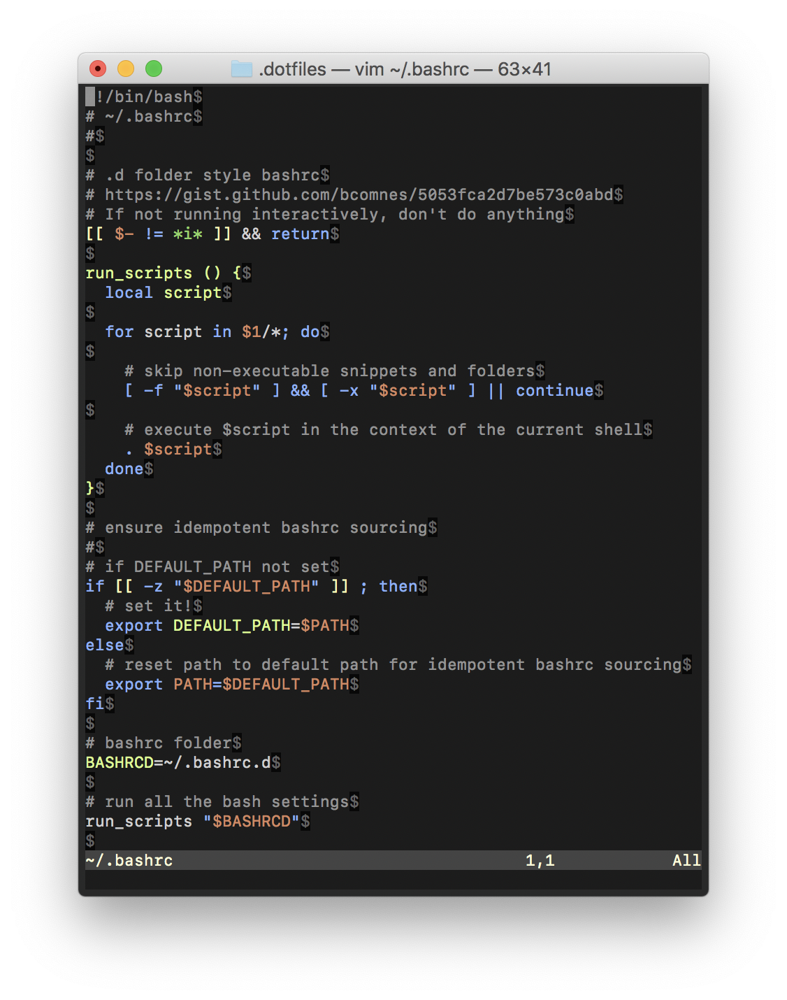

# Dotpiles

Thees are my dotfiles.  Here is an overview:

## Installing:

Download them from github.

```console
$ cd ~
$ git clone git@github.com:bcomnes/.dotfiles.git
```

Bootstrap a ssh keys probably.

Symlink the dotfiles

```console
$ cd ~/.dotfiles/
$ ./install/bret-dk
```

Create or edit the host installer to include the various steps you want.

## Structure

*configs*: Any top level file or folder in `configs` is symlinked to ~/ and prefixed with a `.`.  Any conflicts are moved to `foo.bk` if it is a file, or `foo.symbk` if its a symlink conflict.  If you see conflict warnings, you shoudld handle those sooner than later since the conflict management is backup destructive.

*ssh*: SSH is a weird beast, since its so crucial to the boostrapping process and also contains vital secrets.  We symlink files from inside `ssh` to inside `~/.ssh/` instead of the whole folder. We also update `authorized_keys` from github.

*install*: Scripts to perform installs.  Usually you write a host script that can peice together different sub-scripts.  TODO write boostrappig scripts.



## Bootstrapping nodes

Some bootstrappig notes are in the `notes` folder.  TODO: automate some of that.

Some tasks you may need to perform:

### Vim crap

This setup sucks. Probably just delete this.

```console
# Vim
# vundle
# https://github.com/VundleVim/Vundle.vim
# CLEAN THIS SHIT UP THIS SUCKS
git clone https://github.com/VundleVim/Vundle.vim.git ~/.vim/bundle/Vundle.vim
vim +PluginInstall +qall
```

### Brew file

Periodically dump a brew file:

```console
cd ~/.dotfiles
brew bundle dump # dump whats installed
brew bundle cleanup # clean the brew file
brew bundle check # check the status
```

To install, run:

```cosole
brew bundle
```

## References

I did a few clever and simple bash things that I have found to be extremely bullet proof and simple.  They have survived mostly over the course of like 4-5 installs, which is a personal record.

- [.bashrc.d](https://gist.github.com/bcomnes/5053fca2d7be573c0abd): fragment based bashrc files
- [os_diff.sh](https://gist.github.com/bcomnes/13711d12237e866de5ca): target specific platforms with bash
